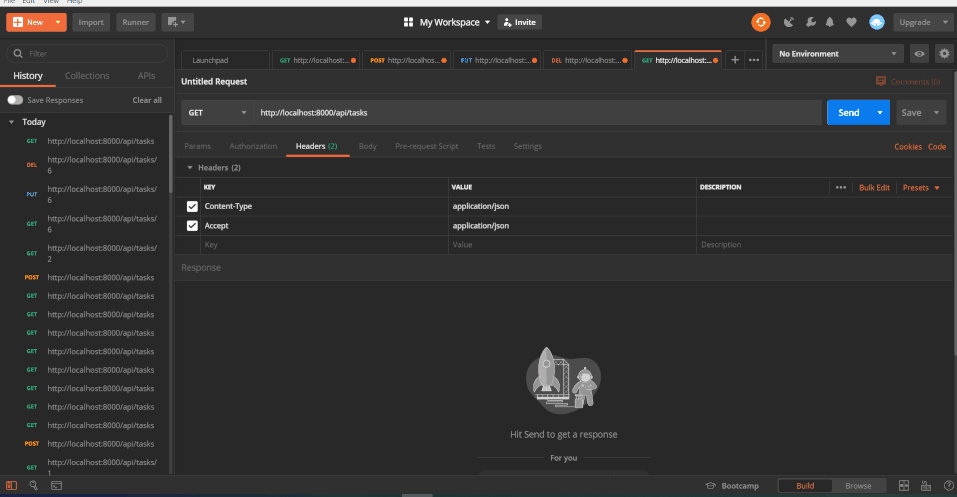

## About
This little project is a RESTful API build in [Laravel](https://github.com/laravel/laravel) to learn the basics of Laravel. The API can show, update and delete tasks.

## Run the API
*Note: php, composer and laravel need to be installed on your device. Laravel has a lot of video tutorials on Laravel, PHP, unit testing, etc on [Laracast](https://laracasts.com).*
*Setting up the local machine is well explained in the [first section of the Laravel-6-from-scratch serie](https://laracasts.com/series/laravel-6-from-scratch).*
```
php artisan migrate:fresh
php artisan serve
```

## Interact with the API
You can use cURL to interact with the API. It's a command line tool for transfering data for various protocols. The tool is installed in the terminal by default.
A more convenient way to interact/test the API is [Postman](https://www.getpostman.com/) which you need to download, install and register for.

- Demo: HTTP GET request to /api/tasks with Postman returns all tasks in json format.


- Demo: HTTP POST request to add a task to the database.


- Demo: HTTP PUT request to update a task in the database.


- Demo: HTTP DELETE request to delete a task from the database.


- Demo: HTTP GET request to get a single task.
